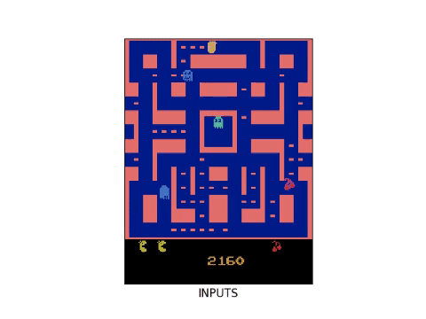
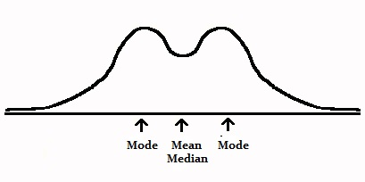

# Video frame prediction by multi scale GAN

<br>This is a <a href="https://chainer.org/">Chainer</a> implementation of <a href="https://arxiv.org/pdf/1511.05440.pdf">"Deep Multi Scale Video Prediction Beyond Mean Square Error"</a>.
The neural network is trained to predict predict upcoming future frame of the video given past few frames. This project has been influenced by the Tensorflow <a href="https://github.com/dyelax/Adversarial_Video_Generation">implementation</a>
of the same paper by dyelax. 

## Why Video frame prediction is important?
The ability of a model to predict future frames requires to build accurate, non trivial internal representations. Learning to
predict future images from a video sequence involves the construction of an internal representation that models the
image evolution accurately, and therefore,  to  some  degree,  its  content  and  dynamics. 

Also, a robust model that can build good internal representations of it's environment can be

## Why use GANs ?
Using an l2 loss, and to a lesser extent l1, produces blurry predicitons, increasingly worsen when predicting further in the future
. If the probability distribution for an output pixel has equally likely modes v1 and v, then the v_avg = (v1 + v2)/2 minimizes the l2
loss over the data even id v_avg has very low probability. In case of l1 norm, the effect diminishes but do not disappear.
<br>


GANs come into rescue because of the inherent nature of the way it's trained. 
<incomplete!! I am writing the README if you are reading this>
## How to run
### Dependencies

* [`Chainer`](https://chainer.org/)
* [`Scipy`](https://www.scipy.org/)
* [`Numpy`](http://www.numpy.org/)
* [`Cupy`(Optional for GPU)](https://github.com/cupy/cupy)


1. Clone or download this repository.
2. Prepare your data:
   I have used the Ms. Pac-Man dataset provided by dyalex which, you can [download here](https://drive.google.com/open?id=0Byf787GZQ7KvV25xMWpWbV9LdUU). Put this in a directory named `data/` in the root of this project for default behavior. Otherwise, you will need to specify your data location using the options outlined in parts 3 and 4.
  If you would like to train on your own videos, preprocess them so that they are directories of frame sequences as structured below.:
  ```
    - data
      - images
        - train
          - Video 1
            - frame1.png
            - frame2.png
            - frame3.png
            - .
            - frameN.png
          - Video 2
          - Video 3
          - Video N
        - test
          - Video 1
            - frame1.png
            - frame2.png
            - frame3.png
            - .
            - frameN.png
          - Video 2
          - Video 3
          - Video N
        - trainclips
        - testclips
   
  ```
3. Process training data:
  The network trains on random 32x32 pixel crops of the input images, filtered to make sure that most clips have some movement in them. To process your input data into this form, run the script `python process_data` from the directory. By default it builds around 500000 compressed clips. You coud change this by - 
  ```shell
python process_data.py -n <number of compressed clips>
```
 You could also manually change the location where the script looks for dataset by changing DATA_DIR, TRAIN_DIR, TEST_DIR parameters in ```constants.py```
  
 
  
  This can take a few hours to complete, depending on the number of clips you want.
  
4. Train/Test:
 To train with the default values simple run ```train.py``` with the the following optional arguements - 
 ```
  -r --resume_training=1 <# The trainer saves trainer extensions at each iteration at result/snapshot
                            and the generative model at result/TRAINED_ADVERSARIAL.model
  -l --load= <Directory of full training frames>
  -g --gpu=0 to use gpu
  -d --data location where the dataset oader looks for data. By default it's data/trainclips
 ```
 
 5. Infer:
 To see how your network performs, you can run ```testmodel.py```. It saves the result of how your model behaves in  a new ```inference/``` folder. It takes in two optional arguments - 
 ```
  -p --path= <path of the model that you want to train. It's by default at result/TRAINED_ADVERSARIAL.model as our
               model gets saved there by default
  -n --no_pred = <int>< number of times you want to recursively predict the next frame. By default it's 7
 ```
